## 👨‍💻 About Me

I'm a software developer interested in the intersection of **backend development, infrastructure and cybersecurity**.

I enjoy working across the complete lifecycle of an application: designing APIs and databases, building frontend and backend systems, deploying services, configuring web servers and maintaining production environments.

My main interests include **software architecture, backend systems, Linux administration, networking, cloud infrastructure and secure software development**.

---

## 💻 Languages

## 🧰 Tech Stack

### Backend

### Frontend

### Databases & Services

### Infrastructure & Networking

### Development & API Tools

---

## 📊 GitHub Analytics

<picture>
  <source media="(prefers-color-scheme: dark)" srcset="./profile/stats.svg">
  <source media="(prefers-color-scheme: light)" srcset="./profile/stats.svg">
  
</picture>

<picture>
  <source media="(prefers-color-scheme: dark)" srcset="./profile/top-langs.svg">
  <source media="(prefers-color-scheme: light)" srcset="./profile/top-langs.svg">
  
</picture>

 

> The language card reflects code detected in GitHub repositories; it is not a measure of proficiency.

---

## 🚀 Featured Projects

  More projects will be added here as public portfolio-ready versions become available.

---

## 🎯 Current Interests

`Backend Development` · `Software Architecture` · `Cybersecurity` · `Linux` · `Cloud Infrastructure` · `Networking` · `DevOps`

---

  

<b>Building software, understanding infrastructure and securing the whole stack.</b>

